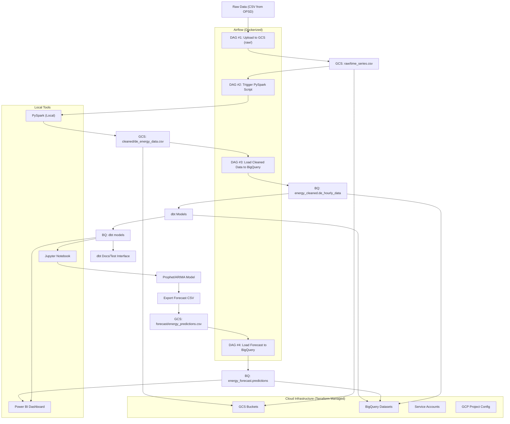

# Energy Consumption Data Lake & Forecasting

## Project Overview
This project presents a comprehensive, production-grade data pipeline built for end-to-end processing and forecasting of energy consumption data, with an initial focus on Germany's energy market. It is designed to demonstrate modern data engineering capabilities by integrating several components that work in harmony across the entire data lifecycle—from raw data ingestion to advanced forecasting and interactive visualization.

The pipeline is cloud-native, meaning it is designed to operate seamlessly on cloud infrastructure using managed services. It is built primarily on Google Cloud Platform (GCP), utilizing a suite of open-source technologies and GCP-native services. The architecture aligns with best practices in modern data engineering, focusing on reliability, modularity, scalability, and automation. The project is centered around batch processing, where energy data is processed at regular intervals to prepare for forecasting tasks.

Key capabilities and tools integrated into this pipeline include:

Infrastructure-as-Code (IaC) with Terraform, enabling repeatable and scalable deployment of cloud infrastructure like GCS buckets, BigQuery datasets, and IAM roles.

Workflow orchestration using Apache Airflow, managed locally in a Docker environment. Airflow schedules and triggers pipeline jobs such as data ingestion, transformation, and model execution.

Distributed data transformation with Apache Spark (PySpark) for efficiently cleaning and preparing large volumes of energy data locally before uploading to GCP.

Cloud data warehousing using BigQuery, serving as a central, structured repository for raw, cleaned, and modeled datasets.

Data modeling and documentation using dbt, which provides modular SQL-based transformations, testing, and documentation directly on BigQuery.

Time-series forecasting using Facebook Prophet in Jupyter Notebooks, incorporating external regressors like solar and wind energy data to enhance prediction accuracy.

Interactive dashboards developed in Power BI, directly connected to BigQuery, allowing users to explore trends, peaks, and forecasting results through visual reports.

Together, these components form a cohesive and automated pipeline capable of handling real-world energy data analytics, offering robust insights for stakeholders in the energy sector.


---

## Tech Stack
- **Terraform**: Infrastructure provisioning on GCP
- **Docker**: Airflow orchestration setup (locally)
- **Google Cloud Platform**:
  - Cloud Storage (GCS)
  - BigQuery
  - IAM & Service Accounts
- **Airflow**: Workflow orchestration with DAGs
- **PySpark**: Local data cleaning and transformation
- **dbt**: Data modeling, documentation, and testing
- **Jupyter Notebook**: Forecasting with Prophet
- **Power BI**: Visualizations and dashboard

---

## Project Structure
```
energy-forecast-pipeline/
├── airflow/                  # Airflow DAGs and Docker setup
│   ├── dags/
│   └── docker/
├── infrastructure/           # Terraform scripts for GCP setup
├── spark/                    # PySpark scripts (run locally)
├── dbt/                      # dbt project (models, seeds, docs)
├── notebooks/                # Forecasting notebooks (Prophet, ARIMA, etc.)
├── data/                     # Local test data or schema examples
├── dashboard/                # Power BI .pbix file or screenshots
├── scripts/                  # Optional Python helpers
├── requirements.txt
└── README.md
```

---

## Architecture Diagram



---

## Execution Steps

### Step 1: Planning & Initialization
- Defined the scope: Focused on Germany's hourly energy load and day-ahead pricing.
- Created forecasts for future energy loads.
- Set up project structure and version control.

### Step 2: Infrastructure Provisioning
- Used Terraform to create:
  - GCS buckets: raw/, cleaned/, forecast/
  - BigQuery datasets: energy_raw, energy_cleaned, energy_forecast
  - IAM roles, service accounts

### Step 3: Airflow Environment Setup
- Dockerized Airflow with webserver, scheduler, Postgres metadata store
- Connected DAGs to local credentials and confirmed GCS access

### Step 4: Raw Data Ingestion
- Downloaded time_series_60min_singleindex.csv from OPSD
- DAG #1: Uploaded file to GCS `raw/`

### Step 5: Data Cleaning & Processing
- Used local PySpark to:
  - Read raw CSV from GCS
  - Filter German energy columns
  - Format timestamps and rename columns
  - Write cleaned data to GCS `cleaned/`
- DAG #2: Triggered Spark job on upload

### Step 6: Load Cleaned Data to BigQuery
- DAG #3: Moved `de_energy_data.csv` to BigQuery
- Defined schema explicitly with float and timestamp types

### Step 7: Data Modeling with dbt
- Created `daily_avg_load`, `monthly_peaks`, and `price_load_correlation` models
- Added column tests and generated documentation

### Step 8: Forecasting
- Loaded `daily_load_summary` from BigQuery into Jupyter
- Built forecasting model using Facebook Prophet
  - Added external regressors: solar and wind
  - Evaluated with MAPE, RMSE
- Exported 360-day forecast to CSV
- DAG #4: Loaded forecast file to BigQuery `energy_forecast`

### Step 9: Dashboarding
- Connected Power BI to BigQuery
- Created interactive report with:
  - Historical usage trends
  - Load vs. price
  - Forecast vs. actuals
  - Filters (by date, aggregation level)
- Exported the final dashboard as a PDF

  - [Download Dashboard PDF](https://github.com/sntk-76/energy-forecast-pipeline/blob/main/dashboard/visualization.pdf)
  - [Power BI Project File](https://unipdit-my.sharepoint.com/:u:/g/personal/sina_tavakoli_studenti_unipd_it/EWr0Y4yJynJPicjQAc2jdbEB10vigPgjouj0YPzxJU5Hdg?e=6eyhwV)

### Step 10: Finalization
- Cleaned and organized the repo
- Added screenshots, output files, and diagrams

---

## Key Features
- End-to-end automation using Airflow
- Modular infrastructure with Terraform
- Clean and scalable architecture
- Support for data modeling, forecasting, and business insights
- Dashboard consumable by stakeholders

---

## How to Run the Project
1. Clone the repo and configure `.env` or credential paths.
2. Deploy GCP infra using Terraform.
3. Launch Docker Airflow and run all DAGs step-by-step.
4. Run Spark scripts locally for transformation.
5. Use dbt to model the BigQuery data.
6. Run Jupyter forecasting notebook to generate predictions.
7. Visualize and explore insights in Power BI.

---

## License
MIT License

---

## Author
**Sina Tavakoli**
