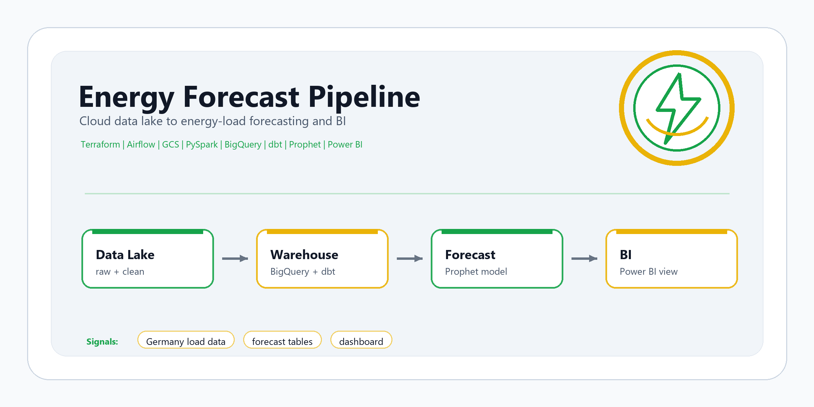

# Energy Forecast Pipeline

**Cloud-native energy data lake, forecasting, and BI pipeline built with Terraform, Airflow, GCS, PySpark, BigQuery, dbt, Prophet, and Power BI.**

[GitHub profile](https://github.com/sntk-76) | [Dashboard PDF](dashboard/visualization.pdf)

## Overview

Energy Forecast Pipeline is an end-to-end data engineering and analytics project for Germany energy-market data. It demonstrates how raw energy time-series data can move through a modern cloud data workflow: ingestion, storage, transformation, warehousing, modeling, forecasting, and dashboard delivery.

The project is intentionally built as a full pipeline rather than a single notebook. Terraform provisions the Google Cloud foundation, Airflow coordinates data movement, PySpark prepares the energy dataset, BigQuery stores analytical tables, dbt creates modeled marts, Prophet generates forecast outputs, and Power BI presents the final business-facing view.

## Why This Project Matters

Energy analytics is a realistic data engineering problem because the data is time-based, multi-source, high-volume, and decision-oriented. Stakeholders need more than raw tables: they need clean warehouse layers, reliable transformations, forecast-ready aggregates, and dashboards that explain load, solar, wind, and demand trends.

For recruiters and technical reviewers, this repository shows practical data engineering judgment across orchestration, infrastructure as code, data lake design, warehouse loading, SQL modeling, forecasting, and BI delivery.

## Core Capabilities

| Capability | Implementation |
| --- | --- |
| Infrastructure as code | Terraform provisions GCS and BigQuery datasets in GCP. |
| Workflow orchestration | Airflow DAGs upload raw, clean, and forecast files and load data into BigQuery. |
| Data lake layout | GCS paths separate `raw/`, `clean/`, and `forecast/` assets. |
| Data transformation | PySpark notebooks clean and structure Germany energy columns. |
| Cloud warehousing | BigQuery stores cleaned energy data and forecast outputs with explicit schemas. |
| Analytics modeling | dbt staging and mart models prepare daily load and renewable generation summaries. |
| Forecasting | Prophet forecasting notebooks generate future load predictions using solar and wind regressors. |
| BI reporting | Power BI connects to modeled data for historical trends, renewable analysis, and forecast views. |

## Architecture


```mermaid
flowchart LR
    A[Raw OPSD Energy CSV] --> B[Airflow: upload_raw_data]
    B --> C[GCS raw/]
    C --> D[PySpark Transformation]
    D --> E[GCS clean/]
    E --> F[Airflow: transfer_clean_data_to_bq]
    F --> G[BigQuery cleaned_data.clean_data]
    G --> H[dbt staging model]
    H --> I[dbt mart models]
    I --> J[Prophet Forecasting Notebook]
    J --> K[GCS forecast/]
    K --> L[Airflow: transfer_forecast_data_to_bq]
    L --> M[BigQuery forecast table]
    I --> N[Power BI Dashboard]
    M --> N

    O[Terraform] --> C
    O --> G
    O --> M
```

## Technical Stack

| Layer | Tools |
| --- | --- |
| Infrastructure | Terraform, Google Cloud Platform |
| Storage | Google Cloud Storage |
| Orchestration | Apache Airflow, Docker Compose |
| Processing | PySpark, Jupyter notebooks |
| Warehouse | BigQuery |
| Modeling | dbt, SQL |
| Forecasting | Prophet, Python |
| BI | Power BI |

## Repository Structure

```text
energy-forecast-pipeline/
|-- airflow/
|   |-- dags/                 # Airflow DAGs for GCS and BigQuery movement
|   `-- docker/               # Local Airflow Docker Compose setup
|-- assets/
|   `-- energy-forecast-cover.png
|-- dashboard/
|   `-- visualization.pdf     # Exported Power BI report
|-- dbt/
|   |-- dbt_project.yml
|   `-- models/
|       |-- staging/
|       `-- mart/
|-- infrastructure/           # Terraform GCP configuration
|-- notebooks/
|   `-- forecasting/          # Prophet forecasting notebook and outputs
|-- project_plan/             # Legacy architecture visuals
|-- spark/                    # PySpark exploration and transformation notebooks
|-- requirements.txt
|-- LICENSE
`-- README.md
```

## Pipeline Workflow

1. Start with raw hourly Germany energy data.
2. Use Airflow to upload the source CSV into GCS under `raw/`.
3. Transform the raw dataset with PySpark, selecting and cleaning Germany load, solar, wind, and regional transmission fields.
4. Upload the cleaned dataset into GCS under `clean/`.
5. Load the cleaned CSV into BigQuery with explicit schema definitions.
6. Use dbt to build a clean staging layer and mart tables for analytics.
7. Run Prophet forecasting on daily load summaries with solar and wind regressors.
8. Export forecast results and upload them into GCS under `forecast/`.
9. Load forecast outputs into BigQuery.
10. Connect Power BI to the warehouse outputs for trend and forecast reporting.

## Airflow DAGs

| DAG | Purpose |
| --- | --- |
| `upload_raw_data` | Uploads the raw energy CSV to GCS. |
| `upload_clean_data` | Uploads the transformed clean CSV to GCS. |
| `transfer_clean_data_to_bq` | Loads clean data from GCS to BigQuery. |
| `upload_forecast_data` | Uploads forecast CSV output to GCS. |
| `transfer_forecast_data_to_bq` | Loads forecast output from GCS to BigQuery. |

## Terraform Infrastructure

The Terraform configuration provisions:

- One Google Cloud Storage bucket for pipeline data assets.
- BigQuery datasets for cleaned data, forecast data, staging, and marts.
- Project, region, bucket, and credential variables for repeatable setup.

```bash
cd infrastructure
terraform init
terraform plan
terraform apply
```

## dbt Models

The dbt layer structures BigQuery data into reusable analytics models:

| Model | Purpose |
| --- | --- |
| `stg_clean_energy` | Casts and standardizes load, solar, wind, and regional energy columns from the cleaned BigQuery table. |
| `daily_load_summary` | Aggregates daily actual load, forecast load, solar generation, wind generation, and regional metrics. |
| `solar_vs_wind_generation` | Summarizes solar and wind generation trends, including onshore and offshore wind splits. |

## Forecasting Layer

The forecasting notebook uses Prophet to generate future energy-load predictions. The forecast workflow includes:

- Daily load summaries from modeled data.
- Solar and wind variables as external regressors.
- Forecast confidence intervals.
- Exported forecast files for downstream loading into BigQuery.

Relevant outputs:

- `notebooks/forecasting/Actual vs Forecast (Next 360 Days).png`
- `notebooks/forecasting/Forecast of Energy Load with Confidence Intervals.png`

## Dashboard Layer

The Power BI report turns the warehouse and forecast outputs into a stakeholder-facing dashboard. It is designed to support analysis of:

- Historical energy load trends.
- Actual load vs. forecast load.
- Solar and wind generation patterns.
- Forecast outputs and future demand behavior.

Dashboard export: [dashboard/visualization.pdf](dashboard/visualization.pdf)

## Running Locally

```bash
git clone https://github.com/sntk-76/energy-forecast-pipeline.git
cd energy-forecast-pipeline

python -m venv .venv
.venv\Scripts\activate
pip install -r requirements.txt
```

On macOS/Linux, activate the environment with:

```bash
source .venv/bin/activate
```

Run Airflow locally:

```bash
cd airflow/docker
docker-compose up
```

Then open the Airflow UI at `http://localhost:8080` and trigger the DAGs in pipeline order.

## Project Highlights

- Shows a complete batch analytics workflow from raw files to BI reporting.
- Uses Terraform to make the GCP foundation reproducible.
- Separates raw, cleaned, forecast, staging, and mart data layers.
- Uses dbt to make warehouse transformations modular and inspectable.
- Connects forecasting outputs back into the warehouse for dashboard consumption.
- Demonstrates the full data engineering path expected in modern analytics platforms.

## Future Improvements

- Add automated DAG dependencies for a single end-to-end pipeline run.
- Add dbt tests and source freshness checks.
- Add CI validation for DAG imports and SQL compilation.
- Containerize the PySpark transformation step.
- Add model-quality monitoring for forecast drift and error trends.

## License

This project is licensed under the [MIT License](LICENSE).
